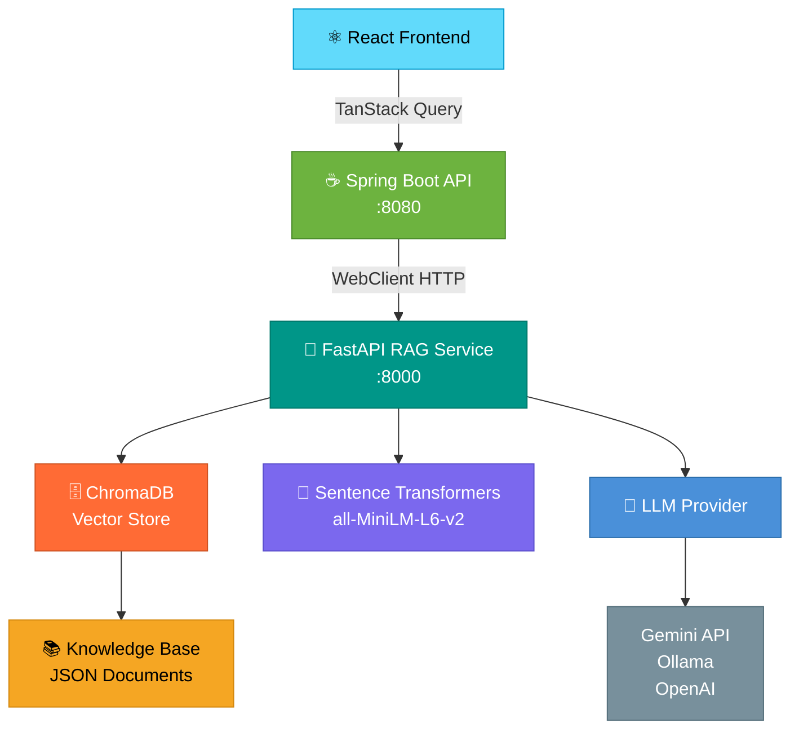
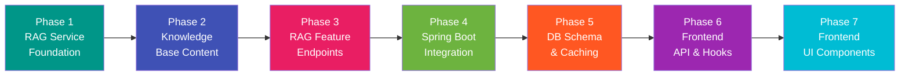
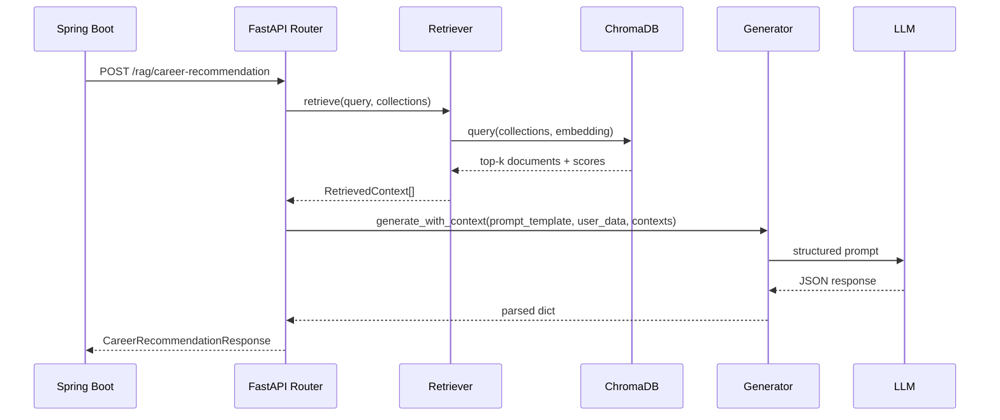

<div align="center">

# 🤖 Twinos Career Digital Twin — RAG Intelligence Layer

**Evidence-based career intelligence powered by Retrieval-Augmented Generation**

[](https://python.org)
[](https://fastapi.tiangolo.com)
[](https://spring.io/projects/spring-boot)
[](https://reactjs.org)
[](https://www.trychroma.com)
[](LICENSE)

</div>

---

## Overview

This document describes the **full RAG (Retrieval-Augmented Generation) system** that replaces all hardcoded career logic in the Twinos Career Digital Twin platform with dynamic, knowledge-driven intelligence.

Instead of static rules and lookup tables, every career insight — skill validation, role recommendations, roadmaps, interview readiness — is now generated by querying a structured knowledge base and synthesizing a response through an LLM. The system is designed as a **non-breaking, additive layer**: all existing endpoints remain functional while new `/api/rag/*` endpoints are added alongside them.

---

## Table of Contents

- [Architecture](#architecture)
- [Tech Stack](#tech-stack)
- [Project Structure](#project-structure)
- [Implementation Phases](#implementation-phases)
  - [Phase 1 — RAG Service Foundation](#phase-1--rag-service-foundation)
  - [Phase 2 — Knowledge Base Content](#phase-2--knowledge-base-content)
  - [Phase 3 — RAG Feature Endpoints](#phase-3--rag-feature-endpoints)
  - [Phase 4 — Spring Boot Integration](#phase-4--spring-boot-integration)
  - [Phase 5 — Database Schema & Caching](#phase-5--database-schema--caching)
  - [Phase 6 — Frontend API & Hooks](#phase-6--frontend-api--hooks)
  - [Phase 7 — Frontend UI Components](#phase-7--frontend-ui-components)
- [API Reference](#api-reference)
- [Knowledge Base Schema](#knowledge-base-schema)
- [LLM Provider Options](#llm-provider-options)
- [Getting Started](#getting-started)
- [Verification & Testing](#verification--testing)
- [Implementation Estimates](#implementation-estimates)
- [Open Questions](#open-questions)

---

## Architecture

The system is composed of three layers communicating over HTTP. The React frontend talks to the Spring Boot API, which delegates intelligence work to a Python FastAPI microservice backed by ChromaDB and an LLM.



**Data flow for a single RAG request:**

```
User Action → React Hook (useMutation)
           → Spring Boot Controller (/api/rag/*)
           → RagService (loads user data from MySQL)
           → FastAPI RAG Service (/rag/*)
               ├── Embed the user's profile data
               ├── Query ChromaDB collections
               ├── Retrieve top-k relevant documents
               ├── Construct LLM prompt with context
               └── Parse structured JSON response
           → Cache result in rag_analysis_cache (MySQL)
           → Return DTO to frontend
```

---

## Tech Stack

| Layer | Technology | Purpose |
|---|---|---|
| Frontend | React 18 + TypeScript + TanStack Query | UI, data fetching, mutations |
| Backend API | Spring Boot 3.x + WebFlux WebClient | REST gateway, caching, orchestration |
| RAG Service | Python 3.10+ + FastAPI + Uvicorn | RAG pipeline, LLM calls |
| Vector Store | ChromaDB (persistent) | Semantic document retrieval |
| Embeddings | `sentence-transformers/all-MiniLM-L6-v2` | 384-dim text embeddings |
| LLM | Gemini API / Ollama / OpenAI | Response generation |
| Database | MySQL (existing) | User data + RAG result caching |

---

## Project Structure

The RAG system introduces a new top-level `rag-service/` directory alongside the existing `backend/` and `src/` directories.

```
twinos-career-digital-twin/
│
├── src/                              # React frontend
│   ├── hooks/
│   │   ├── useRagResumeAnalysis.ts   # [NEW]
│   │   ├── useRagCareerRecommendation.ts  # [NEW]
│   │   ├── useRagRoadmap.ts          # [NEW]
│   │   └── useRagSkillValidation.ts  # [NEW]
│   ├── services/
│   │   └── apiService.ts             # [MODIFY] — add RAG API functions
│   ├── types/
│   │   └── digital-twin.ts           # [MODIFY] — add RAG TypeScript interfaces
│   └── routes/
│       ├── digital-twin.tsx          # [MODIFY] — AI Insights section
│       ├── github-analyzer.tsx       # [MODIFY] — RAG insights panel
│       ├── leetcode-intelligence.tsx # [MODIFY] — interview readiness reasoning
│       ├── roadmap.tsx               # [MODIFY] — enhanced RAG roadmap
│       └── skill-validation.tsx      # [MODIFY] — deep skill evidence panel
│
├── backend/                          # Spring Boot API
│   └── src/main/java/com/twinos/career/
│       ├── config/
│       │   └── RagServiceConfig.java  # [NEW] — WebClient bean
│       ├── controller/
│       │   └── RagController.java     # [NEW] — /api/rag/* endpoints
│       ├── service/
│       │   └── RagService.java        # [NEW] — orchestration logic
│       ├── entity/
│       │   └── RagAnalysisCache.java  # [NEW] — cache entity
│       ├── repository/
│       │   └── RagAnalysisCacheRepository.java  # [NEW]
│       └── dto/rag/                   # [NEW] — 6 response DTOs + nested records
│
└── rag-service/                       # [NEW] Python FastAPI microservice
    ├── requirements.txt
    ├── .env.example
    ├── app.py                         # Entry point, CORS, routers
    ├── config.py                      # Settings (LLM provider, API keys, paths)
    ├── embeddings.py                  # Singleton embedding model
    ├── chromadb_manager.py            # Collection management, idempotent indexing
    ├── document_loader.py             # JSON → Document chunking
    ├── retriever.py                   # Multi-collection semantic search
    ├── generator.py                   # LLM provider abstraction
    ├── prompts/
    │   ├── resume_analysis.py
    │   ├── github_analysis.py
    │   ├── leetcode_analysis.py
    │   ├── career_recommendation.py
    │   ├── skill_validation.py
    │   └── roadmap.py
    ├── routers/
    │   ├── resume.py                  # POST /rag/resume-analysis
    │   ├── github.py                  # POST /rag/github-analysis
    │   ├── leetcode.py                # POST /rag/leetcode-analysis
    │   ├── career.py                  # POST /rag/career-recommendation
    │   ├── skill_validation.py        # POST /rag/skill-validation
    │   └── roadmap.py                 # POST /rag/roadmap
    ├── models/
    │   ├── requests.py                # Pydantic request models
    │   └── responses.py               # Pydantic response models
    └── knowledge-base/
        ├── skills/                    # 5 JSON files
        ├── career_roles/              # 12 JSON files (SWE, DS, PM, etc.)
        ├── interview_prep/            # 4 JSON files (DSA, system design, etc.)
        ├── salary_data/               # 3 JSON files (US, global, by level)
        └── learning_paths/            # 6 JSON files (by domain)
```

---

## Implementation Phases

The implementation follows a strict dependency order — each phase builds on the previous one.



---

### Phase 1 — RAG Service Foundation

Build the Python FastAPI microservice skeleton: application entry point, configuration, embedding model, ChromaDB manager, document loader, retriever, and LLM generator.

**Key design decisions:**

- `embeddings.py` implements a **singleton pattern** so `all-MiniLM-L6-v2` (384-dim) loads exactly once at startup.
- `chromadb_manager.py` uses **idempotent indexing** — collections are populated only if empty, making restarts safe.
- `generator.py` defines a `LLMProvider` base class with three concrete implementations: `GeminiProvider`, `OllamaProvider`, and `OpenAIProvider`. Swapping providers requires only a config change.
- ChromaDB is configured with a **persistent local directory** (`./chroma_data`) so the vector index survives restarts.
- FastAPI CORS is set to allow the Spring Boot origin (`localhost:8080`).

**Files created:** `app.py`, `config.py`, `embeddings.py`, `chromadb_manager.py`, `document_loader.py`, `retriever.py`, `generator.py`, `requirements.txt`, `.env.example`

---

### Phase 2 — Knowledge Base Content

Populate the `knowledge-base/` directory with **50+ structured JSON documents** covering the full career intelligence surface area.

**Collections and document counts:**

| Collection | Files | Description |
|---|---|---|
| `skills` | 5 | Programming languages, frameworks, cloud/DevOps, ML/data, soft skills |
| `career_roles` | 12 | SWE, Data Scientist, PM, Cloud Architect, DevOps, ML Engineer, Frontend, Backend, Fullstack, EM, UX, Mobile |
| `interview_prep` | 4 | DSA benchmarks by company tier, system design patterns, behavioral, company tiers |
| `salary_data` | 3 | US market ranges, global ranges, experience-level breakdowns |
| `learning_paths` | 6 | Backend, frontend, fullstack, data science, cloud, career transitions |

**Career role document schema:**

```json
{
  "role": "Software Engineer",
  "aliases": ["SDE", "Software Developer", "Backend Developer"],
  "description": "Designs, develops, and maintains software systems...",
  "required_skills": {
    "core": ["Java", "Python", "JavaScript", "SQL", "Data Structures", "Algorithms"],
    "frameworks": ["Spring Boot", "React", "Node.js"],
    "tools": ["Git", "Docker", "Kubernetes", "CI/CD"],
    "soft_skills": ["Problem Solving", "Communication", "Team Collaboration"]
  },
  "experience_levels": {
    "junior": { "years": "0-2", "expectations": "..." },
    "mid":    { "years": "2-5", "expectations": "..." },
    "senior": { "years": "5-10", "expectations": "..." },
    "staff":  { "years": "10+", "expectations": "..." }
  },
  "career_progression": ["Junior SDE", "SDE II", "Senior SDE", "Staff Engineer", "Principal Engineer"],
  "interview_focus": ["DSA", "System Design", "Behavioral", "Coding"],
  "salary_range": { "entry": "$80k–$110k", "mid": "$110k–$160k", "senior": "$150k–$250k" },
  "industry_demand": "Very High",
  "related_roles": ["DevOps Engineer", "Full Stack Engineer", "Site Reliability Engineer"],
  "transition_paths": {
    "from": ["IT Support", "QA Engineer", "Data Analyst"],
    "to": ["Engineering Manager", "Architect", "CTO"]
  }
}
```

Data is sourced from O*NET occupation standards, industry benchmarks, and public career intelligence.

---

### Phase 3 — RAG Feature Endpoints

Implement six FastAPI endpoints, each following the same pipeline: **embed → retrieve → prompt → generate → parse JSON**.



**Endpoints:**

| Method | Path | Collections Queried | Purpose |
|---|---|---|---|
| `POST` | `/rag/resume-analysis` | `skills`, `career_roles` | Infer skills, strengths, suitability from resume text |
| `POST` | `/rag/github-analysis` | `skills`, `career_roles` | Verify skills from repos, assess engineering maturity |
| `POST` | `/rag/leetcode-analysis` | `interview_prep` | Score algorithm strengths, assess interview readiness |
| `POST` | `/rag/career-recommendation` | All collections | Evidence-based role recommendations with gap analysis |
| `POST` | `/rag/skill-validation` | `skills` | Multi-source confidence scoring for a single skill |
| `POST` | `/rag/roadmap` | `learning_paths`, `career_roles`, `skills` | Phased learning plan with milestones and resources |

---

### Phase 4 — Spring Boot Integration

Add three new Java files to the existing Spring Boot backend. The key principle: **Spring Boot is the orchestrator, not the intelligence layer** — it loads user data from MySQL, constructs RAG requests, delegates to FastAPI, and caches results.

**`RagServiceConfig.java`** — registers a `WebClient` bean pointing to `http://localhost:8000` with 30s connect / 60s read timeouts (LLM calls are slow).

**`RagService.java`** — six methods, each following this pattern:

```
load user data from MySQL
  → build RAG request payload
  → check rag_analysis_cache (return if valid)
  → call FastAPI via WebClient
  → parse response into DTO
  → write to rag_analysis_cache
  → return DTO
```

**`RagController.java`** — exposes the six endpoints under `/api/rag/*`:

```
POST /api/rag/resume-analysis?userId={id}
POST /api/rag/github-analysis?userId={id}
POST /api/rag/leetcode-analysis?userId={id}
POST /api/rag/career-recommendation?userId={id}
POST /api/rag/skill-validation?userId={id}&skillName={name}
POST /api/rag/roadmap?userId={id}&targetRole={role}
```

**`pom.xml`** — add `spring-boot-starter-webflux` for `WebClient` support.

---

### Phase 5 — Database Schema & Caching

A single new MySQL table caches all RAG analysis results to avoid redundant LLM calls.

```java
@Entity
@Table(name = "rag_analysis_cache")
public class RagAnalysisCache {

    @Id @GeneratedValue(strategy = GenerationType.IDENTITY)
    private Long id;

    @Column(name = "user_id", nullable = false)
    private Long userId;

    // RESUME | GITHUB | LEETCODE | CAREER | SKILL_VALIDATION | ROADMAP
    @Column(name = "analysis_type", nullable = false, length = 50)
    private String analysisType;

    // e.g. "skill:Java" or "role:Cloud Architect"
    @Column(name = "cache_key", nullable = false, length = 255)
    private String cacheKey;

    @Column(name = "response_json", nullable = false, columnDefinition = "MEDIUMTEXT")
    private String responseJson;

    @Column(name = "created_at", nullable = false)
    private Instant createdAt;

    @Column(name = "expires_at", nullable = false)
    private Instant expiresAt;
}
```

**Cache TTL policy** (configurable via `application.properties`):

| Analysis Type | Default TTL |
|---|---|
| Career recommendations | 24 hours |
| Skill validations | 7 days |
| Resume analysis | 24 hours |
| GitHub analysis | 24 hours |
| LeetCode analysis | 24 hours |
| Roadmap | 7 days |

The table is auto-created by Hibernate (`spring.jpa.hibernate.ddl-auto=update`). No migration script required.

---

### Phase 6 — Frontend API & Hooks

Add RAG API calls to `apiService.ts` and create four TanStack Query mutation hooks.

**New API functions in `apiService.ts`:**

```typescript
fetchRagResumeAnalysis(userId: number): Promise<RagResumeAnalysis>
fetchRagGitHubAnalysis(userId: number): Promise<RagGitHubAnalysis>
fetchRagLeetCodeAnalysis(userId: number): Promise<RagLeetCodeAnalysis>
fetchRagCareerRecommendation(userId: number): Promise<RagCareerRecommendation>
fetchRagSkillValidation(userId: number, skillName: string): Promise<RagSkillValidation>
fetchRagRoadmap(userId: number, targetRole: string): Promise<RagRoadmap>
```

**New TypeScript interfaces in `digital-twin.ts`:**

```typescript
interface RagResumeAnalysis       // inferred_skills, hidden_skills, strengths, weaknesses, career_suitability
interface RagGitHubAnalysis       // verified_skills, project_complexity, engineering_maturity, missing_portfolio_skills
interface RagLeetCodeAnalysis     // problem_solving_score, algorithm_strengths, algorithm_weaknesses, interview_readiness
interface RagCareerRecommendation // recommendations (role, score, reasoning, evidence, gaps, next_steps)
interface RagSkillValidation      // skill, confidence, evidence_summary, industry_context, growth_suggestions
interface RagRoadmap              // target_role, estimated_timeline, phases[]

// Supporting types
interface RagEvidence       // source, strength, detail
interface RagPhase          // phase, title, duration, skills_to_learn, actions, resources, milestones
interface InferredSkill     // name, confidence, evidence
interface CareerSuitability // role, score, reasoning
```

**New mutation hooks:**

```
useRagResumeAnalysis.ts          → useMutation wrapping fetchRagResumeAnalysis
useRagCareerRecommendation.ts    → useMutation wrapping fetchRagCareerRecommendation
useRagRoadmap.ts                 → useMutation wrapping fetchRagRoadmap
useRagSkillValidation.ts         → useMutation wrapping fetchRagSkillValidation
```

---

### Phase 7 — Frontend UI Components

Modify five existing route components to surface RAG-powered insights.

| File | Changes |
|---|---|
| `digital-twin.tsx` | Add **AI Insights** section: confidence score bars, evidence cards with source attribution, "Generate AI Analysis" trigger button |
| `github-analyzer.tsx` | Add RAG insights panel after analysis: verified skills with confidence scores, engineering maturity assessment card |
| `leetcode-intelligence.tsx` | Add interview readiness reasoning panel: algorithm strength/weakness cards, improvement plan list |
| `roadmap.tsx` | Enhance roadmap with RAG-generated phase details: learning resources, milestones, and timeline estimates |
| `skill-validation.tsx` | Click any skill for deep validation: evidence panel showing per-source confidence breakdown |

---

## API Reference

### `POST /rag/resume-analysis`

**Request:**
```json
{
  "resume_text": "...",
  "user_skills": ["Java", "Spring Boot", "React"],
  "career_goals": ["Software Engineer", "Cloud Architect"]
}
```

**Response:**
```json
{
  "inferred_skills": [{ "name": "Microservices", "confidence": 0.87, "evidence": "..." }],
  "hidden_skills":   [{ "name": "API Design",    "confidence": 0.72, "evidence": "..." }],
  "strengths":       [{ "area": "Backend Development", "score": 92, "evidence": "..." }],
  "weaknesses":      [{ "area": "Frontend Testing",    "score": 35, "evidence": "..." }],
  "career_suitability": [{ "role": "Software Engineer", "score": 91, "reasoning": "..." }],
  "summary": "..."
}
```

### `POST /rag/github-analysis`

**Response:**
```json
{
  "verified_skills":          [{ "name": "Java",    "confidence": 0.95, "evidence": "..." }],
  "project_complexity":       { "score": 72, "level": "Intermediate", "reasoning": "..." },
  "engineering_maturity":     { "score": 65, "level": "Growing", "indicators": [...] },
  "missing_portfolio_skills": [{ "name": "Testing", "importance": "High", "suggestion": "..." }],
  "summary": "..."
}
```

### `POST /rag/leetcode-analysis`

**Response:**
```json
{
  "problem_solving_score": 72,
  "algorithm_strengths":   [{ "topic": "Arrays", "score": 88, "assessment": "..." }],
  "algorithm_weaknesses":  [{ "topic": "DP",     "score": 35, "recommendation": "..." }],
  "interview_readiness": {
    "service_companies": 85,
    "product_companies": 68,
    "faang_level": 45,
    "reasoning": "..."
  },
  "improvement_plan": ["..."],
  "summary": "..."
}
```

### `POST /rag/career-recommendation`

**Response:**
```json
{
  "recommendations": [{
    "role": "Software Engineer",
    "score": 91,
    "reasoning": "Strong Java backend profile with Spring Boot expertise...",
    "evidence": {
      "resume":   "5+ years Java experience mentioned...",
      "github":   "12 repositories, primarily Java/Spring...",
      "leetcode": "150 problems solved, strong DSA foundation..."
    },
    "gaps":       ["System Design depth", "Cloud certifications"],
    "next_steps": ["Complete AWS Solutions Architect cert", "Build a distributed system project"]
  }],
  "summary": "..."
}
```

### `POST /rag/skill-validation`

**Response:**
```json
{
  "skill": "Java",
  "confidence": 95,
  "evidence_summary": [
    { "source": "Resume",   "strength": 90, "detail": "..." },
    { "source": "GitHub",   "strength": 95, "detail": "..." },
    { "source": "LeetCode", "strength": 80, "detail": "..." }
  ],
  "industry_context":   "Java is a top-3 enterprise language...",
  "related_skills":     ["Spring Boot", "Hibernate", "Maven"],
  "growth_suggestions": ["Learn Spring Cloud", "Explore GraalVM"]
}
```

### `POST /rag/roadmap`

**Response:**
```json
{
  "target_role": "Cloud Architect",
  "estimated_timeline": "12-18 months",
  "phases": [{
    "phase": 1,
    "title": "Cloud Foundation",
    "duration": "3 months",
    "skills_to_learn": ["AWS Core Services", "Cloud Networking", "IAM"],
    "actions":    ["Complete AWS Cloud Practitioner", "Build a 3-tier app on AWS"],
    "resources":  ["AWS Skill Builder", "Adrian Cantrill's course"],
    "milestones": ["Pass AWS Cloud Practitioner exam"]
  }],
  "summary": "..."
}
```

---

## Knowledge Base Schema

Each knowledge category follows a consistent JSON schema. The document loader chunks these into ChromaDB with metadata tags enabling filtered retrieval.

**Chunking strategy:**
- Each top-level JSON object → one ChromaDB document
- Large entries → split by paragraphs (max 512 tokens per chunk)
- Metadata includes: `category`, `source_file`, `role_name` / `skill_name` / `path_name`

**Collections and their retrieval use cases:**

```
skills            ← skill validation, resume analysis, GitHub analysis
career_roles      ← career recommendations, resume analysis, roadmap
interview_prep    ← LeetCode analysis, interview readiness scoring
salary_data       ← career recommendations (context enrichment)
learning_paths    ← roadmap generation, career transition advice
```

---

## LLM Provider Options

The system abstracts LLM providers behind a single interface. Select one via the `LLM_PROVIDER` environment variable.

| Provider | Config Key | Recommended? | Notes |
|---|---|---|---|
| **Gemini API** | `gemini` | ✅ Yes | Free tier: 15 RPM. Requires `GEMINI_API_KEY` from Google AI Studio. Uses `gemini-2.0-flash`. |
| **Ollama** | `ollama` | For offline use | Fully local, no API key. Requires Ollama running locally. Set `OLLAMA_BASE_URL`. |
| **OpenAI** | `openai` | Alternative | Requires `OPENAI_API_KEY`. Higher cost but widely supported. |

All providers return structured JSON. The generator parses the LLM output and handles retries on malformed responses.

---

## Getting Started

### Prerequisites

- Python 3.10+
- Java 17+
- Node.js 18+
- MySQL 8.x (existing setup)
- A Gemini API key from [Google AI Studio](https://aistudio.google.com/) *(if using Gemini)*

### 1. Set up the RAG Service

```bash
cd rag-service
python -m venv .venv
source .venv/bin/activate        # Windows: .venv\Scripts\activate

pip install -r requirements.txt
cp .env.example .env
```

Edit `.env`:

```env
LLM_PROVIDER=gemini
GEMINI_API_KEY=your_key_here
CHROMA_PERSIST_DIR=./chroma_data
EMBEDDING_MODEL=all-MiniLM-L6-v2
KNOWLEDGE_BASE_DIR=./knowledge-base
```

Start the service:

```bash
python -m uvicorn app:app --host 0.0.0.0 --port 8000 --reload
```

The knowledge base is indexed automatically on first startup.

### 2. Configure Spring Boot

In `backend/src/main/resources/application.properties`:

```properties
twinos.rag.service-url=http://localhost:8000
twinos.rag.cache-ttl-hours=24
```

In `backend/pom.xml`, add:

```xml
<dependency>
    <groupId>org.springframework.boot</groupId>
    <artifactId>spring-boot-starter-webflux</artifactId>
</dependency>
```

Start Spring Boot:

```bash
cd backend
mvn spring-boot:run
```

### 3. Start the Frontend

```bash
cd src
npm install
npm run dev
```

---

## Verification & Testing

Run the full verification sequence after each phase to confirm the system is working end-to-end.

```bash
# 1. Verify RAG service health and knowledge base indexing
curl http://localhost:8000/rag/health

# 2. Test resume analysis directly against FastAPI
curl -X POST http://localhost:8000/rag/resume-analysis \
  -H "Content-Type: application/json" \
  -d '{"resume_text": "Experienced Java developer with 5 years Spring Boot...", "user_skills": ["Java"], "career_goals": ["Software Engineer"]}'

# 3. Test via Spring Boot gateway (verifies integration)
curl -X POST "http://localhost:8080/api/rag/resume-analysis?userId=1"

# 4. Verify caching (second call should return instantly)
curl -X POST "http://localhost:8080/api/rag/resume-analysis?userId=1"

# 5. Test career recommendation (most complex — queries all collections)
curl -X POST "http://localhost:8080/api/rag/career-recommendation?userId=1"

# 6. Test roadmap generation
curl -X POST "http://localhost:8080/api/rag/roadmap?userId=1&targetRole=Cloud%20Architect"
```

### Manual Verification Checklist

- [ ] Upload a resume → trigger RAG resume analysis → inferred skills and career suitability appear in UI
- [ ] Analyze GitHub → RAG GitHub panel shows verified skills and engineering maturity score
- [ ] Analyze LeetCode → interview readiness reasoning and improvement plan displayed
- [ ] Generate career recommendations → scores show evidence attribution per source (resume / GitHub / LeetCode)
- [ ] Click a skill in skill validation → confidence breakdown by source renders correctly
- [ ] Generate roadmap → phased plan with resources and milestones appears
- [ ] Repeat any request → cached result returned without LLM latency

---

## Implementation Estimates

| Phase | New Files | Estimated Lines |
|---|---|---|
| 1. RAG Service Foundation | 7 Python files | ~600 |
| 2. Knowledge Base Content | 25+ JSON files | ~3,000 |
| 3. RAG Feature Endpoints | 12 Python files | ~900 |
| 4. Spring Boot Integration | 10 Java files | ~500 |
| 5. Database Schema & Caching | 2 Java files | ~100 |
| 6. Frontend API & Hooks | 6 TypeScript files | ~300 |
| 7. Frontend UI Components | 5 modified TSX files | ~400 |
| **Total** | **~67 files** | **~5,800** |

---

## Open Questions

The following decisions should be confirmed before implementation begins:

**1. LLM Provider**
Gemini API is recommended (free tier, 15 RPM, no local setup). Ollama is available for fully offline operation. OpenAI is a fallback. The provider abstraction means this can be changed at any time via config.

**2. Salary Data Scope**
Should the knowledge base include salary ranges (sourced from public estimates)? Including salary data improves career recommendation context but risks inaccuracy if ranges become stale. Omitting it keeps the system focused on skill-fit signals.

**3. Cache TTL**
Current defaults: 24 hours for career recommendations and resume analysis, 7 days for skill validations and roadmaps. These can be tuned per analysis type via `application.properties`.

---

<div align="center">

**Twinos Career Digital Twin** — built with FastAPI, Spring Boot, React, ChromaDB, and Sentence Transformers.

</div>
