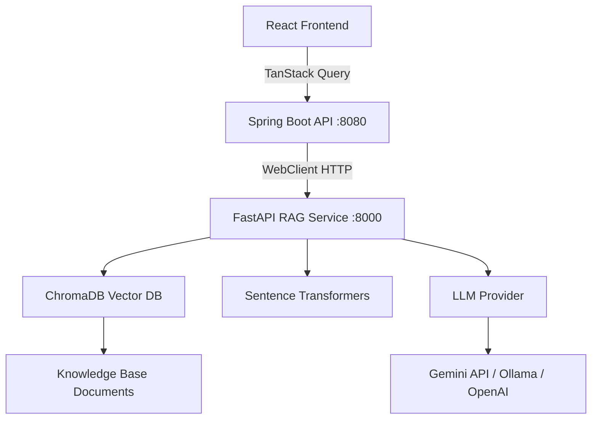
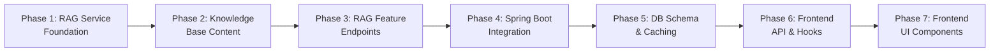

# RAG System for Twinos Career Digital Twin

Implement a complete Retrieval-Augmented Generation (RAG) architecture to replace all hardcoded career logic with evidence-based, knowledge-driven intelligence.

## Architecture Overview



> [!IMPORTANT]
> **LLM Provider Decision Required**: The plan supports Gemini API (recommended—free tier available), Ollama (fully local/offline), or OpenAI. Which do you prefer as the primary LLM? The system will be designed with a provider abstraction so you can swap later.

## User Review Required

> [!IMPORTANT]
> **Non-breaking integration**: The RAG system is additive. Existing endpoints remain functional. New `/api/rag/*` endpoints are added alongside them. The frontend gets new hooks that call the RAG endpoints. This means you can run old and new systems simultaneously during the transition.

> [!WARNING]
> **Python dependency**: This introduces a Python FastAPI microservice that must run alongside Spring Boot. You'll need Python 3.10+ installed. ChromaDB and sentence-transformers will be installed via `pip`.

> [!IMPORTANT]
> **Gemini API Key**: If using Gemini as the LLM provider, you'll need a Google AI Studio API key (free tier: 15 RPM). Set via environment variable `GEMINI_API_KEY`.

## Open Questions

1. **LLM Provider**: Gemini API (recommended), Ollama (local), or OpenAI? This affects cost, latency, and setup complexity.
2. **Knowledge base scope**: Should we include salary data sourced from public ranges (Glassdoor-style estimates), or omit salary data to avoid inaccuracy?
3. **Caching TTL**: How long should RAG analysis results be cached before re-generation? Suggested: 24 hours for career recommendations, 7 days for skill validations.

---

## Proposed Changes

### Phase 1 — RAG Service Foundation

#### [NEW] `rag-service/` (Python FastAPI microservice)

New top-level directory alongside `backend/` and `src/`:

```
rag-service/
├── requirements.txt
├── .env.example
├── app.py                    # FastAPI entry point, CORS, routers
├── config.py                 # Settings (LLM provider, API keys, paths)
├── embeddings.py             # Embedding generation with sentence-transformers
├── chromadb_manager.py       # ChromaDB client, collection management
├── document_loader.py        # Load & chunk knowledge base documents
├── retriever.py              # Semantic search over ChromaDB
├── generator.py              # LLM prompt construction & response generation
├── prompts/
│   ├── resume_analysis.py    # Resume analysis prompt template
│   ├── github_analysis.py    # GitHub analysis prompt template
│   ├── leetcode_analysis.py  # LeetCode analysis prompt template
│   ├── career_recommendation.py  # Career recommendation prompt
│   ├── skill_validation.py   # Skill validation prompt
│   └── roadmap.py            # Roadmap generation prompt
├── routers/
│   ├── resume.py             # POST /rag/resume-analysis
│   ├── github.py             # POST /rag/github-analysis
│   ├── leetcode.py           # POST /rag/leetcode-analysis
│   ├── career.py             # POST /rag/career-recommendation
│   ├── skill_validation.py   # POST /rag/skill-validation
│   └── roadmap.py            # POST /rag/roadmap
├── models/
│   ├── requests.py           # Pydantic request models
│   └── responses.py          # Pydantic response models
└── knowledge-base/
    ├── skills/
    │   ├── programming_languages.json
    │   ├── frameworks_libraries.json
    │   ├── cloud_devops.json
    │   ├── data_ml.json
    │   └── soft_skills.json
    ├── career_roles/
    │   ├── software_engineer.json
    │   ├── data_scientist.json
    │   ├── product_manager.json
    │   ├── cloud_architect.json
    │   ├── devops_engineer.json
    │   ├── ml_engineer.json
    │   ├── frontend_engineer.json
    │   ├── backend_engineer.json
    │   ├── fullstack_engineer.json
    │   ├── engineering_manager.json
    │   ├── ux_designer.json
    │   └── mobile_developer.json
    ├── interview_prep/
    │   ├── dsa_benchmarks.json
    │   ├── system_design.json
    │   ├── behavioral.json
    │   └── company_tiers.json
    ├── salary_data/
    │   ├── us_market.json
    │   ├── global_ranges.json
    │   └── experience_levels.json
    └── learning_paths/
        ├── backend_path.json
        ├── frontend_path.json
        ├── fullstack_path.json
        ├── data_science_path.json
        ├── cloud_path.json
        └── career_transitions.json
```

##### Key files detail:

**[NEW] [requirements.txt](file:///e:/future-path-muse-main/future-path-muse-main/rag-service/requirements.txt)**
- `fastapi`, `uvicorn[standard]`, `chromadb`, `sentence-transformers`, `google-generativeai` (for Gemini), `pydantic`, `python-dotenv`

**[NEW] [app.py](file:///e:/future-path-muse-main/future-path-muse-main/rag-service/app.py)**
- FastAPI app with CORS (allow Spring Boot origin `localhost:8080`)
- Startup event: load embeddings model, initialize ChromaDB, index knowledge base if needed
- Include all routers under `/rag` prefix
- Health check endpoint at `/rag/health`

**[NEW] [config.py](file:///e:/future-path-muse-main/future-path-muse-main/rag-service/config.py)**
- Pydantic Settings: `LLM_PROVIDER` (gemini/ollama/openai), `GEMINI_API_KEY`, `OPENAI_API_KEY`, `OLLAMA_BASE_URL`, `CHROMA_PERSIST_DIR`, `EMBEDDING_MODEL`, `KNOWLEDGE_BASE_DIR`

**[NEW] [embeddings.py](file:///e:/future-path-muse-main/future-path-muse-main/rag-service/embeddings.py)**
- Load `all-MiniLM-L6-v2` model at startup (384-dim embeddings)
- `embed_text(text: str) -> list[float]`
- `embed_texts(texts: list[str]) -> list[list[float]]`
- Implements a singleton pattern to avoid reloading the model

**[NEW] [chromadb_manager.py](file:///e:/future-path-muse-main/future-path-muse-main/rag-service/chromadb_manager.py)**
- Persistent ChromaDB client (`./chroma_data`)
- Collections: `skills`, `career_roles`, `interview_prep`, `salary_data`, `learning_paths`
- `index_documents(collection_name, documents, metadatas, ids)`
- `query(collection_name, query_text, n_results=5) -> list[dict]`
- Idempotent indexing (skip if collection already populated)

**[NEW] [document_loader.py](file:///e:/future-path-muse-main/future-path-muse-main/rag-service/document_loader.py)**
- Load JSON files from `knowledge-base/` subdirectories
- Chunk strategy: each JSON entry becomes one document with metadata (category, source_file, role_name, etc.)
- For large entries, chunk by paragraphs (max 512 tokens per chunk)
- Returns `list[Document]` with `text`, `metadata`, `id`

**[NEW] [retriever.py](file:///e:/future-path-muse-main/future-path-muse-main/rag-service/retriever.py)**
- `retrieve(query: str, collections: list[str], n_results: int = 10) -> list[RetrievedContext]`
- Queries multiple collections and merges results
- Returns ranked list of `RetrievedContext(text, metadata, relevance_score)`
- Supports metadata filtering (e.g., filter by role name, skill category)

**[NEW] [generator.py](file:///e:/future-path-muse-main/future-path-muse-main/rag-service/generator.py)**
- Provider abstraction: `LLMProvider` base class with `generate(prompt: str) -> str`
- `GeminiProvider`: Uses `google-generativeai` with `gemini-2.0-flash`
- `OllamaProvider`: Uses HTTP to local Ollama API
- `OpenAIProvider`: Uses `openai` Python SDK
- `generate_with_context(prompt_template, user_data, retrieved_contexts) -> dict`
- JSON structured output parsing from LLM responses

---

### Phase 2 — Knowledge Base Content

#### [NEW] Knowledge base JSON files

Each JSON file is a structured dataset. Example structure for a career role:

```json
{
  "role": "Software Engineer",
  "aliases": ["SDE", "Software Developer", "Backend Developer"],
  "description": "Designs, develops, and maintains software systems...",
  "required_skills": {
    "core": ["Java", "Python", "JavaScript", "SQL", "Data Structures", "Algorithms"],
    "frameworks": ["Spring Boot", "React", "Node.js"],
    "tools": ["Git", "Docker", "Kubernetes", "CI/CD"],
    "soft_skills": ["Problem Solving", "Communication", "Team Collaboration"]
  },
  "experience_levels": {
    "junior": {"years": "0-2", "expectations": "..."},
    "mid": {"years": "2-5", "expectations": "..."},
    "senior": {"years": "5-10", "expectations": "..."},
    "staff": {"years": "10+", "expectations": "..."}
  },
  "career_progression": ["Junior SDE", "SDE II", "Senior SDE", "Staff Engineer", "Principal Engineer"],
  "interview_focus": ["DSA", "System Design", "Behavioral", "Coding"],
  "salary_range": {"entry": "$80k-$110k", "mid": "$110k-$160k", "senior": "$150k-$250k"},
  "industry_demand": "Very High",
  "related_roles": ["DevOps Engineer", "Full Stack Engineer", "Site Reliability Engineer"],
  "transition_paths": {
    "from": ["IT Support", "QA Engineer", "Data Analyst"],
    "to": ["Engineering Manager", "Architect", "CTO"]
  }
}
```

I will create **50+ knowledge documents** spanning all categories with real-world accurate data derived from O*NET occupation data, industry standards, and public career intelligence.

---

### Phase 3 — RAG Feature Endpoints

#### POST `/rag/resume-analysis`

**Request:**
```json
{
  "resume_text": "...",
  "user_skills": ["Java", "Spring Boot", "React"],
  "career_goals": ["Software Engineer", "Cloud Architect"]
}
```

**Retrieval:** Query `skills` + `career_roles` collections with resume text segments

**Generation prompt template:**
```
You are a career intelligence system. Analyze this resume using the retrieved career knowledge.

RESUME:
{resume_text}

KNOWN SKILLS: {user_skills}

RELEVANT CAREER KNOWLEDGE:
{retrieved_contexts}

Generate a JSON response with:
- inferred_skills: skills detected from resume context not yet in known skills
- hidden_skills: skills implied but not explicitly stated
- strengths: top areas of expertise with evidence
- weaknesses: skill gaps or areas needing improvement
- career_suitability: list of {role, score, reasoning} ranked by fit
```

**Response:**
```json
{
  "inferred_skills": [{"name": "Microservices", "confidence": 0.87, "evidence": "..."}],
  "hidden_skills": [{"name": "API Design", "confidence": 0.72, "evidence": "..."}],
  "strengths": [{"area": "Backend Development", "score": 92, "evidence": "..."}],
  "weaknesses": [{"area": "Frontend Testing", "score": 35, "evidence": "..."}],
  "career_suitability": [{"role": "Software Engineer", "score": 91, "reasoning": "..."}],
  "summary": "..."
}
```

#### POST `/rag/github-analysis`

**Request:**
```json
{
  "repositories": [{"name": "...", "language": "...", "stars": 5, "topics": [...], "description": "..."}],
  "languages": ["Java", "Python"],
  "total_stars": 15,
  "contribution_score": 72
}
```

**Retrieval:** Query `skills` + `career_roles` with language and topic data

**Response:**
```json
{
  "verified_skills": [{"name": "Java", "confidence": 0.95, "evidence": "..."}],
  "project_complexity": {"score": 72, "level": "Intermediate", "reasoning": "..."},
  "engineering_maturity": {"score": 65, "level": "Growing", "indicators": [...]},
  "missing_portfolio_skills": [{"name": "Testing", "importance": "High", "suggestion": "..."}],
  "summary": "..."
}
```

#### POST `/rag/leetcode-analysis`

**Request:**
```json
{
  "total_solved": 150,
  "easy_solved": 80,
  "medium_solved": 55,
  "hard_solved": 15,
  "contest_rating": 1650,
  "ranking": 85000,
  "strengths": ["Arrays", "Trees"],
  "weaknesses": ["Dynamic Programming"]
}
```

**Retrieval:** Query `interview_prep` collection with stats context

**Response:**
```json
{
  "problem_solving_score": 72,
  "algorithm_strengths": [{"topic": "Arrays", "score": 88, "assessment": "..."}],
  "algorithm_weaknesses": [{"topic": "DP", "score": 35, "recommendation": "..."}],
  "interview_readiness": {
    "service_companies": 85,
    "product_companies": 68,
    "faang_level": 45,
    "reasoning": "..."
  },
  "improvement_plan": ["..."],
  "summary": "..."
}
```

#### POST `/rag/career-recommendation`

**Request:**
```json
{
  "resume_text": "...",
  "skills": ["Java", "Spring Boot", "React", "SQL"],
  "github_data": {"languages": [...], "repositories": 12, "stars": 8},
  "leetcode_data": {"total_solved": 150, "problem_solving_score": 72},
  "career_goals": ["Software Engineer"]
}
```

**Retrieval:** Query all collections with combined profile

**Response:**
```json
{
  "recommendations": [
    {
      "role": "Software Engineer",
      "score": 91,
      "reasoning": "Strong Java backend profile with Spring Boot expertise...",
      "evidence": {
        "resume": "5+ years Java experience mentioned...",
        "github": "12 repositories, primarily Java/Spring...",
        "leetcode": "150 problems solved, strong DSA foundation..."
      },
      "gaps": ["System Design depth", "Cloud certifications"],
      "next_steps": ["Complete AWS Solutions Architect cert", "Build a distributed system project"]
    }
  ],
  "summary": "..."
}
```

#### POST `/rag/skill-validation`

**Request:**
```json
{
  "skill_name": "Java",
  "resume_evidence": "5 years Java development...",
  "github_evidence": "15 Java repositories...",
  "leetcode_evidence": "80 problems in Java..."
}
```

**Retrieval:** Query `skills` collection for the specific skill

**Response:**
```json
{
  "skill": "Java",
  "confidence": 95,
  "evidence_summary": [
    {"source": "Resume", "strength": 90, "detail": "..."},
    {"source": "GitHub", "strength": 95, "detail": "..."},
    {"source": "LeetCode", "strength": 80, "detail": "..."}
  ],
  "industry_context": "Java is a top-3 enterprise language...",
  "related_skills": ["Spring Boot", "Hibernate", "Maven"],
  "growth_suggestions": ["Learn Spring Cloud", "Explore GraalVM"]
}
```

#### POST `/rag/roadmap`

**Request:**
```json
{
  "current_skills": ["Java", "SQL", "React"],
  "target_role": "Cloud Architect",
  "experience_years": 3,
  "career_goals": ["Transition to cloud infrastructure"]
}
```

**Retrieval:** Query `learning_paths` + `career_roles` + `skills`

**Response:**
```json
{
  "target_role": "Cloud Architect",
  "estimated_timeline": "12-18 months",
  "phases": [
    {
      "phase": 1,
      "title": "Cloud Foundation",
      "duration": "3 months",
      "skills_to_learn": ["AWS Core Services", "Cloud Networking", "IAM"],
      "actions": ["Complete AWS Cloud Practitioner", "Build a 3-tier app on AWS"],
      "resources": ["AWS Skill Builder", "Adrian Cantrill's course"],
      "milestones": ["Pass AWS Cloud Practitioner exam"]
    }
  ],
  "summary": "..."
}
```

---

### Phase 4 — Spring Boot Integration

#### [NEW] [RagServiceConfig.java](file:///e:/future-path-muse-main/future-path-muse-main/backend/src/main/java/com/twinos/career/config/RagServiceConfig.java)
- Configure `WebClient` bean for the RAG service (`http://localhost:8000`)
- Timeout settings (30s connect, 60s read — LLM calls are slow)
- Configuration property `twinos.rag.service-url`

#### [NEW] [RagService.java](file:///e:/future-path-muse-main/future-path-muse-main/backend/src/main/java/com/twinos/career/service/RagService.java)
- Injects `WebClient`
- Methods:
  - `analyzeResume(Long userId)` — Fetches resume text + user skills from DB, calls `/rag/resume-analysis`
  - `analyzeGitHub(Long userId)` — Fetches GitHub profile from DB, calls `/rag/github-analysis`
  - `analyzeLeetCode(Long userId)` — Fetches LeetCode profile from DB, calls `/rag/leetcode-analysis`
  - `getCareerRecommendations(Long userId)` — Aggregates all user data, calls `/rag/career-recommendation`
  - `validateSkill(Long userId, String skillName)` — Gathers evidence, calls `/rag/skill-validation`
  - `generateRoadmap(Long userId, String targetRole)` — Calls `/rag/roadmap`
- Each method: loads user data from MySQL → constructs RAG request → calls FastAPI → parses response → caches in DB → returns DTO

#### [NEW] [RagController.java](file:///e:/future-path-muse-main/future-path-muse-main/backend/src/main/java/com/twinos/career/controller/RagController.java)
- `POST /api/rag/resume-analysis?userId={id}`
- `POST /api/rag/github-analysis?userId={id}`
- `POST /api/rag/leetcode-analysis?userId={id}`
- `POST /api/rag/career-recommendation?userId={id}`
- `POST /api/rag/skill-validation?userId={id}&skillName={name}`
- `POST /api/rag/roadmap?userId={id}&targetRole={role}`

#### [NEW] RAG DTO classes (`dto/rag/` package):
- `RagResumeAnalysisResponse.java`
- `RagGitHubAnalysisResponse.java`
- `RagLeetCodeAnalysisResponse.java`
- `RagCareerRecommendationResponse.java`
- `RagSkillValidationResponse.java`
- `RagRoadmapResponse.java`
- Supporting nested record types for evidence, phases, etc.

---

### Phase 5 — Database Schema Changes

#### [NEW] [RagAnalysisCache.java](file:///e:/future-path-muse-main/future-path-muse-main/backend/src/main/java/com/twinos/career/entity/RagAnalysisCache.java)

New entity to cache RAG analysis results:

```java
@Entity
@Table(name = "rag_analysis_cache")
public class RagAnalysisCache {
    @Id @GeneratedValue(strategy = GenerationType.IDENTITY)
    private Long id;
    
    @Column(name = "user_id", nullable = false)
    private Long userId;
    
    @Column(name = "analysis_type", nullable = false, length = 50)
    private String analysisType;  // RESUME, GITHUB, LEETCODE, CAREER, SKILL_VALIDATION, ROADMAP
    
    @Column(name = "cache_key", nullable = false, length = 255)
    private String cacheKey;  // e.g., "skill:Java" or "role:Cloud Architect"
    
    @Column(name = "response_json", nullable = false, columnDefinition = "MEDIUMTEXT")
    private String responseJson;
    
    @Column(name = "created_at", nullable = false)
    private Instant createdAt;
    
    @Column(name = "expires_at", nullable = false)
    private Instant expiresAt;
}
```

#### [NEW] [RagAnalysisCacheRepository.java](file:///e:/future-path-muse-main/future-path-muse-main/backend/src/main/java/com/twinos/career/repository/RagAnalysisCacheRepository.java)
- `findByUserIdAndAnalysisTypeAndCacheKeyAndExpiresAtAfter()`
- `deleteByUserIdAndAnalysisType()`
- `deleteExpired()`

MySQL table auto-created by Hibernate (`ddl-auto=update`).

---

### Phase 6 — Frontend Integration

#### [NEW] RAG API functions in [apiService.ts](file:///e:/future-path-muse-main/future-path-muse-main/src/services/apiService.ts)

Add new functions:
- `fetchRagResumeAnalysis(userId: number)`
- `fetchRagGitHubAnalysis(userId: number)`
- `fetchRagLeetCodeAnalysis(userId: number)`
- `fetchRagCareerRecommendation(userId: number)`
- `fetchRagSkillValidation(userId: number, skillName: string)`
- `fetchRagRoadmap(userId: number, targetRole: string)`

#### [NEW] RAG types in [digital-twin.ts](file:///e:/future-path-muse-main/future-path-muse-main/src/types/digital-twin.ts)

Add new TypeScript interfaces:
- `RagResumeAnalysis`, `RagGitHubAnalysis`, `RagLeetCodeAnalysis`
- `RagCareerRecommendation`, `RagSkillValidation`, `RagRoadmap`
- `RagEvidence`, `RagPhase`, `InferredSkill`, `CareerSuitability`

#### [NEW] RAG hooks in `src/hooks/`:
- [useRagResumeAnalysis.ts](file:///e:/future-path-muse-main/future-path-muse-main/src/hooks/useRagResumeAnalysis.ts) — `useMutation` for triggering resume RAG analysis
- [useRagCareerRecommendation.ts](file:///e:/future-path-muse-main/future-path-muse-main/src/hooks/useRagCareerRecommendation.ts) — `useMutation` for career recommendations
- [useRagRoadmap.ts](file:///e:/future-path-muse-main/future-path-muse-main/src/hooks/useRagRoadmap.ts) — `useMutation` for roadmap generation
- [useRagSkillValidation.ts](file:///e:/future-path-muse-main/future-path-muse-main/src/hooks/useRagSkillValidation.ts) — `useMutation` for skill validation

---

### Phase 7 — Frontend UI Components

#### [MODIFY] [digital-twin.tsx](file:///e:/future-path-muse-main/future-path-muse-main/src/routes/digital-twin.tsx)
- Add "AI Insights" section showing RAG-powered analysis
- Confidence scores with animated progress bars
- Evidence cards with source attribution
- "Generate AI Analysis" button to trigger RAG

#### [MODIFY] [github-analyzer.tsx](file:///e:/future-path-muse-main/future-path-muse-main/src/routes/github-analyzer.tsx)
- Add RAG-powered GitHub insights panel after analysis
- Show verified skills with confidence scores
- Engineering maturity assessment card

#### [MODIFY] [leetcode-intelligence.tsx](file:///e:/future-path-muse-main/future-path-muse-main/src/routes/leetcode-intelligence.tsx)
- Add RAG-powered interview readiness reasoning
- Algorithm strength/weakness analysis with improvement plans

#### [MODIFY] [roadmap.tsx](file:///e:/future-path-muse-main/future-path-muse-main/src/routes/roadmap.tsx)
- Enhanced roadmap with RAG-generated phase details
- Learning resources, milestones, and timeline estimates

#### [MODIFY] [skill-validation.tsx](file:///e:/future-path-muse-main/future-path-muse-main/src/routes/skill-validation.tsx)
- Click any skill to get RAG-powered deep validation
- Evidence panel with confidence breakdown by source

#### [MODIFY] [application.properties](file:///e:/future-path-muse-main/future-path-muse-main/backend/src/main/resources/application.properties)
- Add `twinos.rag.service-url=http://localhost:8000`
- Add `twinos.rag.cache-ttl-hours=24`

#### [MODIFY] [pom.xml](file:///e:/future-path-muse-main/future-path-muse-main/backend/pom.xml)
- Add `spring-boot-starter-webflux` dependency (for `WebClient`)

---

## Implementation Order



| Phase | Files | Estimated LOC |
|-------|-------|---------------|
| 1. RAG Service Foundation | 7 Python files | ~600 |
| 2. Knowledge Base Content | 25+ JSON files | ~3000 |
| 3. RAG Feature Endpoints | 12 Python files (routers + prompts) | ~900 |
| 4. Spring Boot Integration | 10 Java files | ~500 |
| 5. Database Schema & Caching | 2 Java files | ~100 |
| 6. Frontend API & Hooks | 6 TypeScript files | ~300 |
| 7. Frontend UI Components | 5 modified TSX files | ~400 |
| **Total** | **~67 files** | **~5800** |

---

## Verification Plan

### Automated Tests

```bash
# 1. Start RAG service and verify health
cd rag-service && python -m uvicorn app:app --port 8000
curl http://localhost:8000/rag/health

# 2. Verify knowledge base indexed
curl http://localhost:8000/rag/health  # should show collection counts

# 3. Test individual RAG endpoints
curl -X POST http://localhost:8000/rag/resume-analysis -H "Content-Type: application/json" -d '{"resume_text": "Experienced Java developer...", "user_skills": ["Java"], "career_goals": ["Software Engineer"]}'

# 4. Start Spring Boot and verify integration
cd backend && mvn spring-boot:run
curl -X POST "http://localhost:8080/api/rag/resume-analysis?userId=1"

# 5. Verify caching
curl -X POST "http://localhost:8080/api/rag/resume-analysis?userId=1"  # should return cached
```

### Manual Verification

1. Upload a resume → trigger RAG resume analysis → verify inferred skills and career suitability appear
2. Analyze GitHub → trigger RAG GitHub analysis → verify verified skills and engineering maturity
3. Analyze LeetCode → trigger RAG LeetCode analysis → verify interview readiness reasoning
4. Generate career recommendations → verify evidence-based scores with source attribution
5. Validate a skill → verify confidence scores with evidence from each source
6. Generate roadmap → verify phased learning plan with resources and milestones
7. Verify cached results are returned instantly on repeat requests
